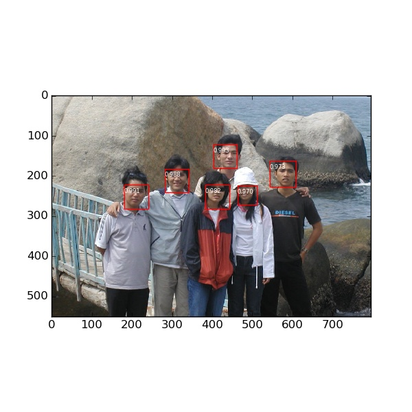
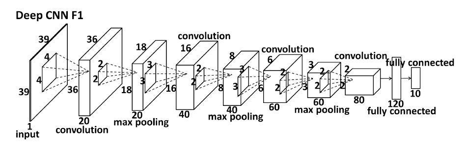
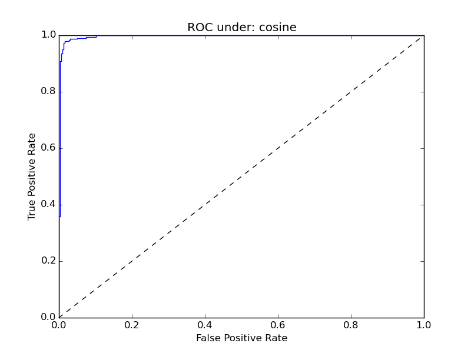

# DeepFace
a deep face analysis implement, mainly based on -[Caffe](https://github.com/BVLC/caffe). At this time, face analysis tasks like detection, alignment and recognition have been done. -[中文Readme](https://github.com/RiweiChen/DeepFace/blob/master/README_ch.md)

Each task is divide by different folder.

##Face detection

###baseline
Face detection using sliding windows style, it first train a face/noface two class classification network, and then tranform to a full convolution network, detection is based on the heatmap when input a large full size image.

face detection result example：

  
##Face key points detection

###try1_1
face 5 key points detection using DeepID architecture.

face 5 key points detection result example：

##Face Verification
###deepid
Face verification based on DeepID network architecture.

face verification ROC result：

##Face Dataset

We collect the face datasets usually used by recently years' paper, and divide by different task. Also we  simply describe each of the dataset.(In Chinese)

For more implement details, please reference my blog
- [1983的专栏](http://blog.csdn.net/chenriwei2)

It is welcome for everyone to make suggestions and improvement.
